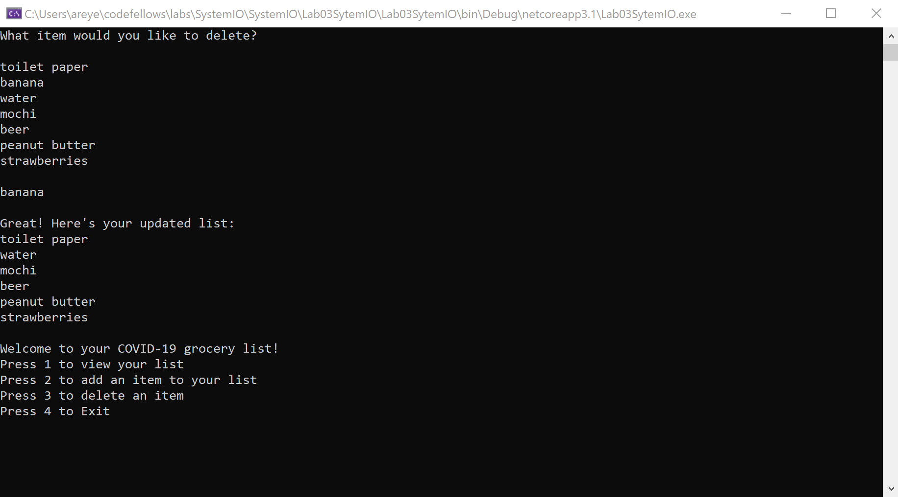

# COVID-19 Grocery List

Lab03-SystemIO

*Authors: Matthew Johnson, Carrington Beard, and Allyson Reyes*

----

## Description
This is a C# console application that allows users to create a COVID-19 essentials grocery list. 
The user is allowed to view, add items, and delete items into their own list.

---

### Getting Started
Clone this repository to your local machine.

```
$ git clone [https://github.com/401-lab03/SystemIO.git]
```

### To run the program from Visual Studio:
Select ```File``` -> ```Open``` -> ```Project/Solution```

Next navigate to the location you cloned the Repository.

Double click on the ```Lab03SystemIO``` directory.

Then select and open ```Lab03SystemIO.sln```

---

### Visuals


#### Application Start
  
Here is the first look of our application. The user can view their options and choose one of their liking. 
#### Using the Application
  
The user is able to view their list. 
  
Here you can see how the user can add an item and see their updated list.
  
The user is able to delete their item and see their updated list.

#### Application End
  
This is the end of the application. 

---

### Change Log
1.3: *Finished readme and summary comments* - 3/19/2020  
1.2: *Built and implemented all application methods and started unit testing.* - 3/19/2020  
1.1: *Created the set up of adding the program file into the test file and structure out methods* - 3/18/2020


------------------------------
